# Secawan Coffee

**Secawan** ("a cup" in Malay) is a single-page brand site for a fictional highland specialty coffee roastery, inspired by the misty highlands of Malaysia. It is a frontend portfolio piece: warm editorial design, organic motion, playful interactive UI and real-time 3D, built with Vue 3.

> Secawan is a fictional brand created for a design portfolio. No real shop, no real checkout.

**Live demo:** https://secawan.hytechster.com/

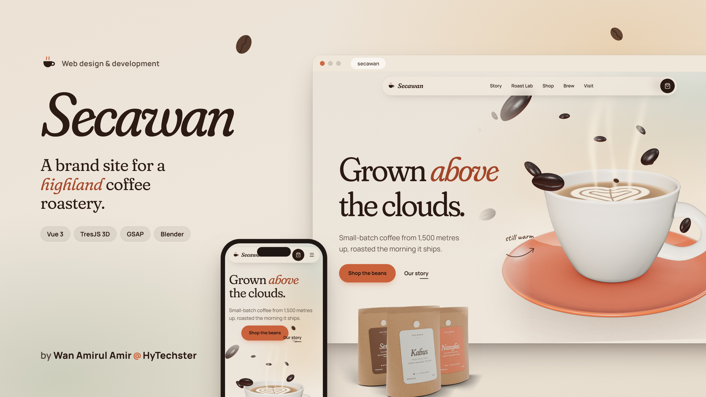

## Screenshots

| | |
|---|---|
| 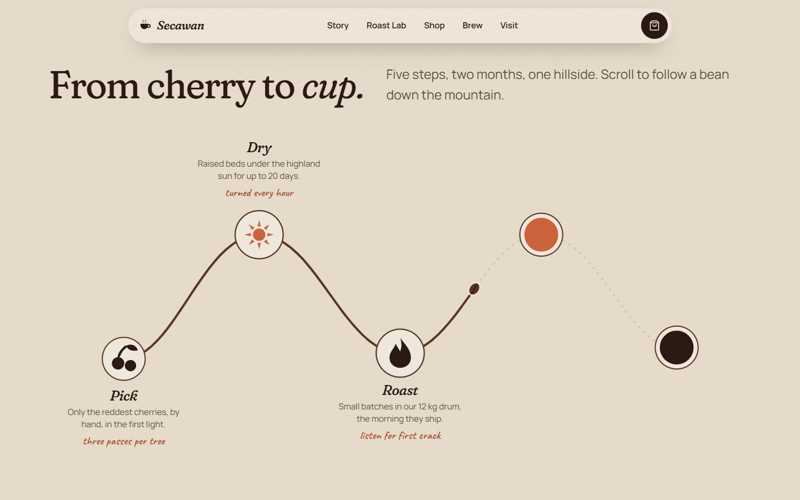 | 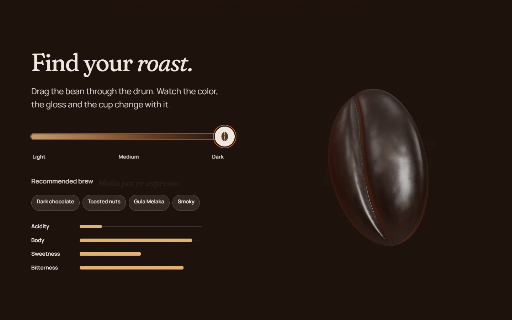 |
| 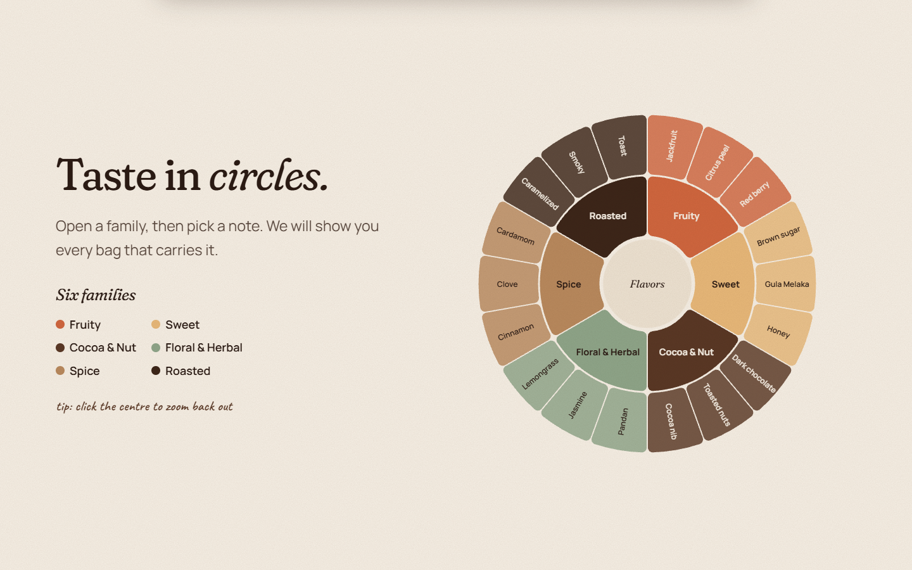 | 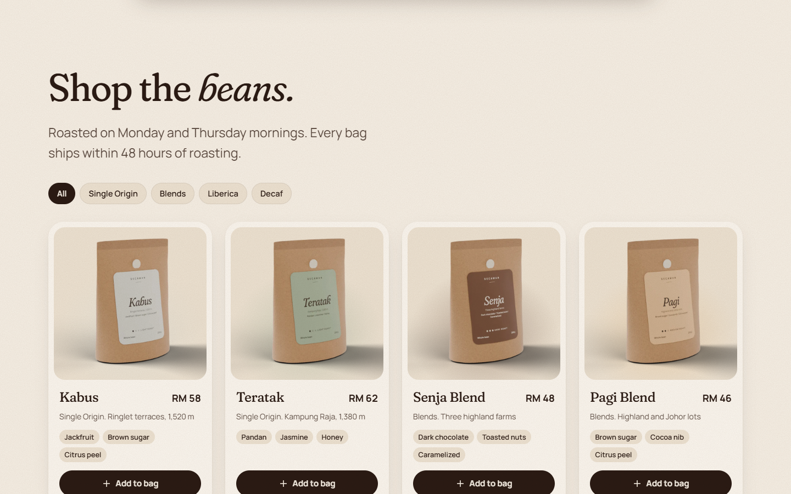 |
| 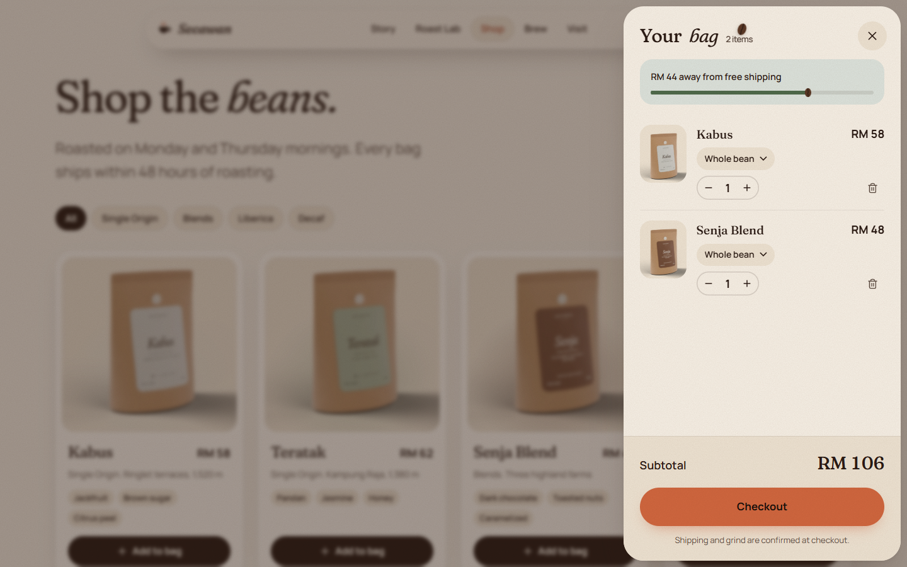 | 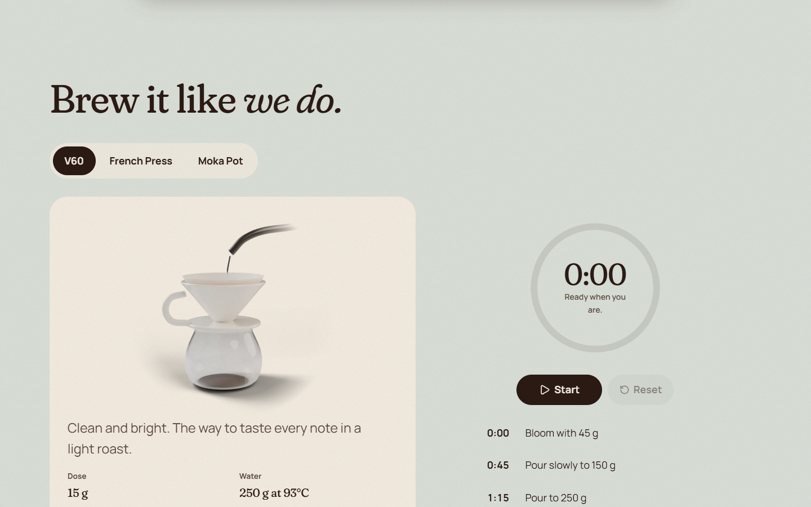 |
| 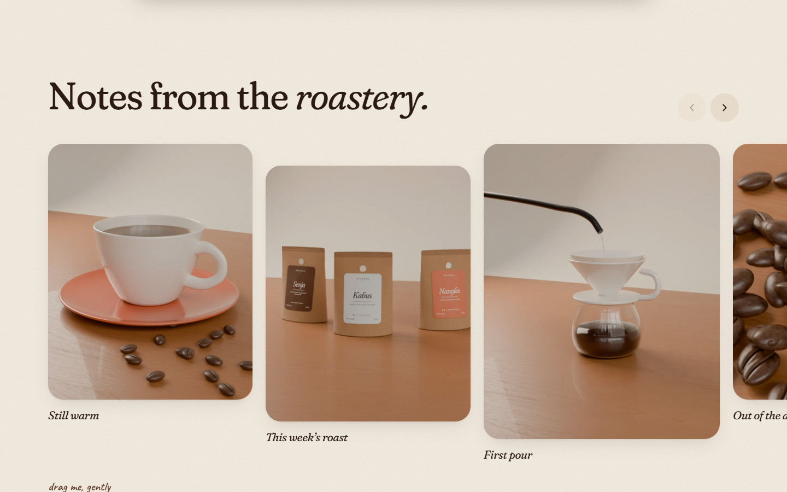 | 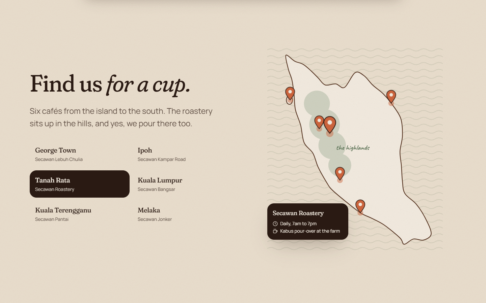 |
| 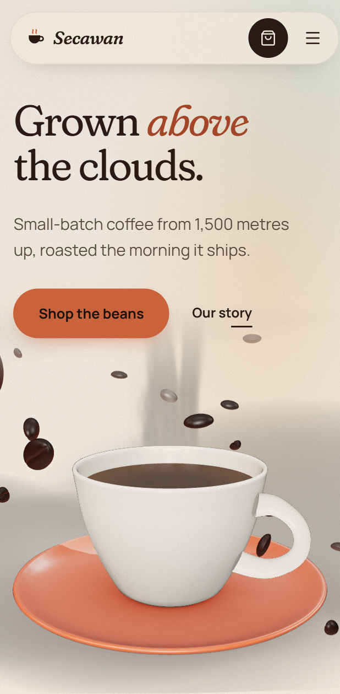 | |

## Features

- **Pouring preloader.** An SVG cup fills with a liquid wave in step with real loading (web fonts plus the 3D scene), then steams and fades into the hero. It is skipped under reduced motion.
- **3D hero (TresJS).** A glazed stoneware cup and saucer modelled in Blender (foot ring, rounded lip, a handle that joins the wall), loaded as one 160 KB meshopt-compressed GLB with baked contact shadows. Crema with a ripple shader, curling steam shaders, 40 instanced beans with baked colour and normal maps, studio reflections and drifting mist. The scene leans toward the pointer; as you scroll away, the beans scatter, the cup turns and the camera climbs above the clouds.
- **Tasting notes marquee.** Two rows run in opposite directions and speed up with scroll velocity.
- **Origin story.** A clay diorama of the highlands built in Blender (tree-topped ridges, stepped tea terraces, coffee shrubs with ripe cherries, a drying hut, clay clouds), rendered as five transparent layers that scroll at different speeds, with mist bands drifting between them, an altitude meter that counts from sea level to 1,500 m, and copy that reveals line by line.
- **Bean to Cup.** A pinned section where one SVG path draws itself, a bean rides along it (MotionPath), and each stage icon morphs from a circle into its illustration (MorphSVG). Mobile gets a simpler vertical path.
- **Roast Lab.** A keyboard-accessible custom slider drives a Pinia store. The background, text contrast, the Blender bean's roast colour and oily sheen, tasting chips, flavor bars and brew recommendation all derive from one value.
- **Flavor wheel.** `d3-hierarchy` and `d3-shape` do the math and Vue renders the SVG. Segments lift on hover, a category click zooms in, and picking a note filters the shop and scrolls to it.
- **Shop and cart.** Filter chips, animated grid re-ordering, 3D tilt cards with glare, fly-to-cart beans along a bezier arc, and a cart drawer with grind options, steppers, a free-shipping bar and an odometer subtotal. The cart persists across reloads. Checkout opens a friendly demo modal.
- **Brew guide.** Accessible tabs with a sliding indicator, Blender renders of a V60, French press and moka pot that move from "brewing" to "done", and a real-time brew timer whose dial doubles as a scrubber: drag the knob round the clock (or use the arrow keys) to see any moment of the recipe, or tap a step to jump to it.
- **Numbers, gallery, map, newsletter, footer.** An odometer number band, a draggable Embla gallery with tilt-on-drag and a keyboard and swipe lightbox, a stylized map with pins synced to a café list, a newsletter form with gentle shake validation and a canvas bean shower, and a giant wordmark with steam rising from the first A.
- **Global touches.** A bean-shaped custom cursor that turns toward its movement and grows into "View" and "Add" labels, wavy section dividers, a paper-grain overlay and morphing blobs.

## Why Vue for this project

Secawan is animation-heavy and interaction-rich, but its state is simple. Vue fits that balance. Built-in **`<Transition>` / `<TransitionGroup>`** handle enter/leave, tab cross-fades and list re-ordering without extra libraries. **Composables** turn every effect (magnetic buttons, tilt, split reveals, fly-to-cart) into small reusable functions. **TresJS** writes the 3D scene declaratively in templates, so the cup, steam and beans react to Pinia state (like the roast level) with plain reactivity. **SFCs with scoped styles** keep each section's markup, logic and styling together, and Vite keeps development instant. A heavier framework would add structure this single page doesn't need.

## Tech stack

| Purpose | Library |
|---|---|
| Framework | Vue 3 (`<script setup lang="ts">`), Vite 8, TypeScript |
| State | Pinia + `pinia-plugin-persistedstate` (cart) |
| Styling | Tailwind CSS v4, scoped SFC styles, CSS variable design tokens |
| 3D | TresJS (`@tresjs/core`, `@tresjs/cientos`) on Three.js |
| Scroll and timelines | GSAP with ScrollTrigger, SplitText, DrawSVG, MorphSVG, MotionPath, Flip |
| Smooth scroll | Lenis, synced to ScrollTrigger |
| Component motion | `<Transition>`, `<TransitionGroup>`, `@vueuse/motion` |
| Utilities | `@vueuse/core` |
| Data viz | `d3-shape`, `d3-hierarchy` (flavor wheel only) |
| Carousel | Embla Carousel |
| Small lists | `@formkit/auto-animate` |
| Icons | Lucide (`@lucide/vue`), Simple Icons for social marks |
| Testing | Vitest (stores), Playwright (visual review) |

## Getting started

```bash
npm install
npm run dev        # Vite dev server
npm run build      # type-check (vue-tsc) + static build to dist/
npm run preview    # preview the production build
npm run test       # Vitest unit tests
```

### Visual review with Playwright

```bash
npm run shots:install   # one time: downloads Chromium
npm run shots           # boots the dev server and captures every section
```

Screenshots land in `screenshots/desktop`, `screenshots/mobile` and `screenshots/reduced` (that folder is gitignored). The run also fails on any console error or Vue warning, so it doubles as a smoke test. Headless Chromium uses SwiftShader, so the 3D scenes render too.

### Blender assets

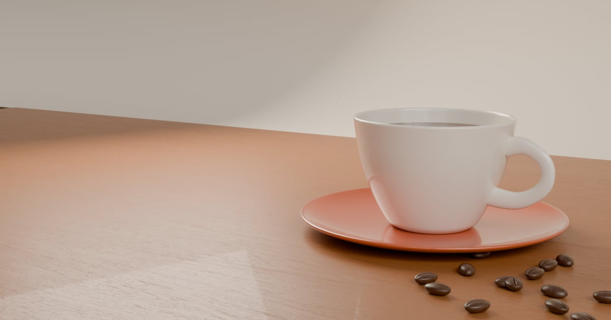

Every product visual comes from one Blender file, `design/blender/secawan-hero.blend` (Cycles, with a Poly Haven studio HDRI and oak texture, both CC0). Each scene feeds a different part of the site:

| Scene | Ships as |
|---|---|
| Secawan Assets | `public/models/secawan-cup.glb` (cup, saucer, crema, bean) and baked textures in `public/models/textures/` |
| Secawan Bags | `public/images/bags/*.webp`, one stand-up kraft pouch per coffee. Labels are printed from the product data by `scripts/render-labels.mjs` |
| Secawan Brew | `public/images/brew/*-start.webp` and `*-end.webp` for the V60, French press and moka pot |
| Secawan Gallery | `public/images/gallery/*.webp` (6 stills), `hero-cup` (shown when WebGL is unavailable; preview with `?no-webgl`), `og-image` (1200 x 630 share card) and `cup.webp` (empty bag and demo modal) |
| Secawan Diorama | `public/images/highlands/*.webp`, the five parallax layers of the Origin Story panel |
| Secawan Icon | `apple-touch-icon.png`, `icon-192.png`, `icon-512.png` |

Master PNGs are kept in `design/blender/renders/`. The GLB was compressed with `gltf-transform meshopt`, and three.js decodes it with its bundled decoder, so no CDN is involved.

The favicon is one simple mark at two levels of detail. At tab sizes it is a flat vector bean on a terracotta tile (`public/favicon.svg`, plus a 16/32/48 px `favicon.ico`). For home-screen and app icons (`apple-touch-icon.png`, `icon-192.png`, `icon-512.png`) the same bean is rendered in Blender's "Secawan Icon" scene and composited onto the exact brand terracotta. Rebuild them with `npm run icons`.

## Project structure

```
src/
  components/
    layout/      TheNav, TheFooter, ThePreloader, CustomCursor, CartDrawer, Lightbox, DemoModal
    ui/          BaseButton, Chip, SectionHeading, Marquee, LazySection, Odometer, RoastSlider,
                 ProductCard, CoffeeBag, GalleryPhoto, BrewIllustration, WaveDivider, BlobBackdrop
  sections/      HeroSection, NotesMarquee, OriginStory, BeanToCup, RoastLab, FlavorWheel,
                 ShopSection, BrewGuide, NumbersBand, FarmGallery, FindUs, NewsletterCta
  three/         HeroScene, SceneRig, CoffeeCup, Steam, Beans, MistClouds, RoastBean, RoastBeanMesh,
                 assets.ts (GLB + texture loader), env.ts, dpr.ts, shaders/
design/blender/  secawan-hero.blend, labels/, renders/
scripts/         build-icons.mjs, render-labels.mjs
  composables/   useLenis, useScrollTrigger, useReducedMotion, useMagnetic, useTilt, useSplitReveal,
                 useCountUp, useFlyToCart, useFocusTrap
  directives/    v-reveal, v-magnetic, v-parallax
  stores/        cart, roastLab, brewTimer, filters, ui (with Vitest specs)
  data/          products, flavors, brewMethods, cafes, story
  styles/        tokens.css, typography.css, base.css
tests/           Playwright screenshot review
```

## Accessibility and motion

- `useReducedMotion()` is the single source of truth. Under reduced motion the preloader is skipped, Lenis, pinning, parallax, marquees, blob morphing and 3D auto-motion are off, and every section shows its final state. Add `?reduced-motion` to the URL to preview this mode on any device.
- The roast slider, brew tabs, gallery, lightbox, cart drawer, mobile menu and demo modal follow WAI-ARIA patterns: roles, `aria-valuenow`, `aria-selected`, a focus trap, Escape to close and focus restore.
- Every interactive element has a visible terracotta focus ring. The Roast Lab flips its text color at the midpoint so contrast stays at WCAG AA across the whole slider.
- 3D canvases are `aria-hidden` with text equivalents, and every section is a `section[aria-labelledby]` landmark.

## Performance

- Two WebGL canvases at most (hero and Roast Lab). DPR is clamped to 2 (1.5 on phones), and render loops pause when off-screen or when the tab is hidden.
- The 3D models total about 160 KB and their baked textures about 115 KB; product and gallery renders are 15-40 KB WebPs, lazy-loaded with explicit sizes.
- The Roast Lab, flavor wheel, gallery and map load lazily through `<LazySection>` and `defineAsyncComponent`, with skeleton placeholders.
- Three.js, TresJS and GSAP are split into their own chunks. Animations touch `transform` and `opacity`.
- Every GSAP context, listener and custom Three.js geometry, material and texture is cleaned up on unmount.

## Credits

Designed and built by **Wan Amirul Amir @ HyTechster**.

## License

[MIT](LICENSE.md) © 2026 Wan Amirul Amir bin Wan Romzi
